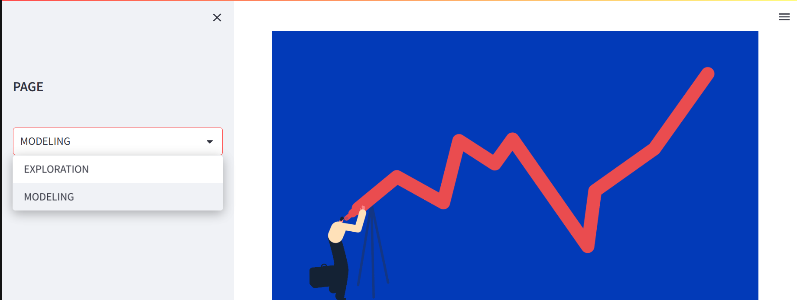

# Stock-Predictor

## Table of contents

- [Objective](#Objective)
- [Overview](#Overview)
- [Technologies Used ](#technologies-used)
- [Results](#Results)

## Objective
[(Back to top)](#Table-of-contents)

The objective of the application Is to provide an easy-to use and quick app for stock price analysis and predictions using technos such as 

## Overview
[(Back to top)](#Table-of-contents)
 The app is divided in two sections :

 

 * Exploration :
    This section is made for EDA ,                          visualization ,Descriptive stats and some statistics test to know better the data your data.
    There is also a "Comparison" section to allow you to compare as much as 4 stocks Closing price along with their distribitions 

    
 * Modeling :
   This Part allow the user to predict future closing prices using either NProphet or LSTM  
 
## Technologies used
[(Back to top)](#Table-of-contents)

## Results
[(Back to top)](#Table-of-contents)

API link :https://ismael616-stock-predictor-app-4rh757.streamlit.app/

